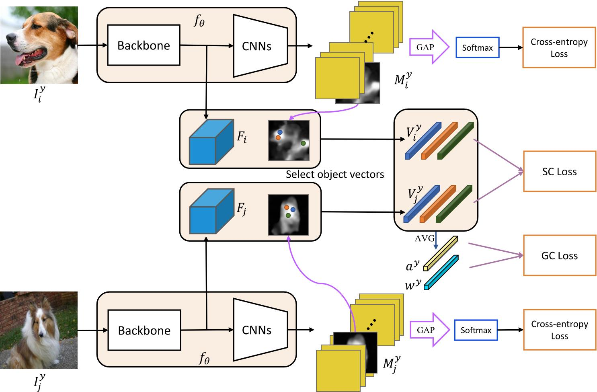
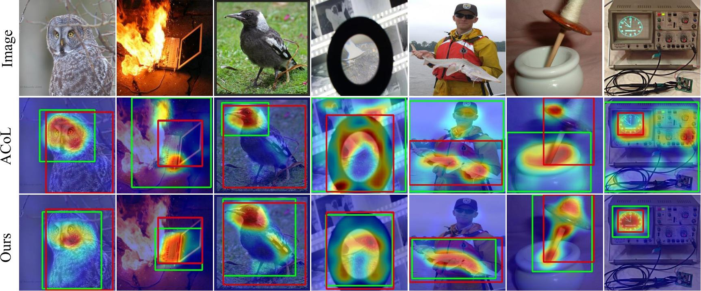

### (ECCV2020)  [Inter-Image Communication for Weakly Supervised Localization](http://www.ecva.net/papers/eccv_2020/papers_ECCV/papers/123640273.pdf)


## Overview of I2C


## Build Module
```
cd models/obj_simi/
python build.py build_ext --inplace
```

## Train
We finetune the `I2C` model on the ILSVRC dataset.  
```
cd scripts
sh train.sh
```


## Test
 Use the test script to generate attention maps.
```
cd scripts
sh val.sh
```




### Citation
If you find this code helpful, please consider to cite this paper:
```
@inproceedings{zhang2020inter,
  title={Inter-Image Communication for Weakly Supervised Localization},
  author={Zhang, Xiaolin and Wei, Yunchao and  Yang, Yi},
  booktitle={European Conference on Computer Vision},
  year={2020},
  organization={Springer}
}
```
